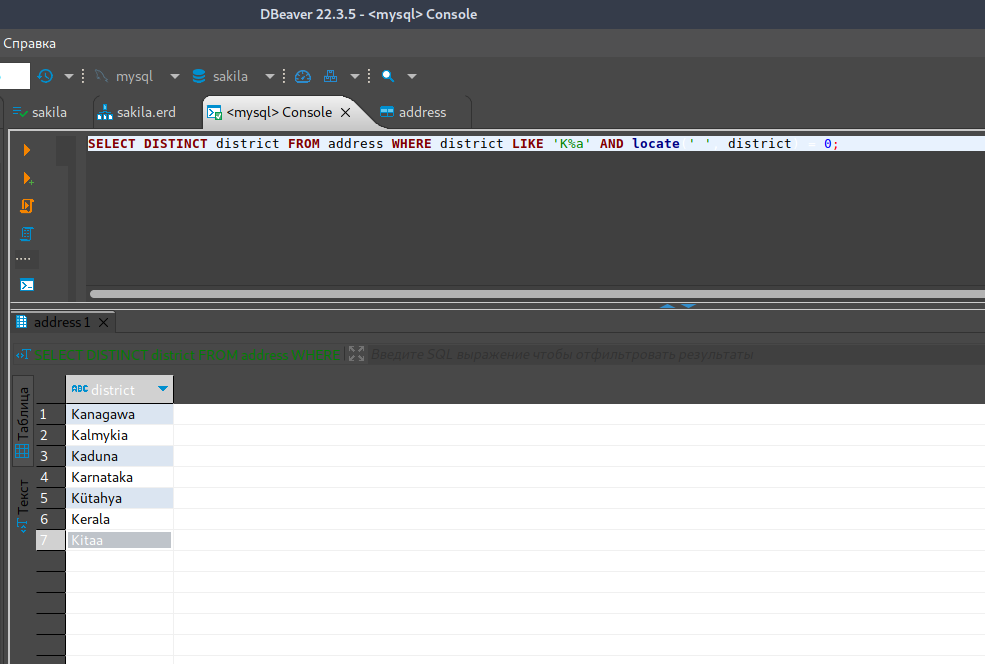
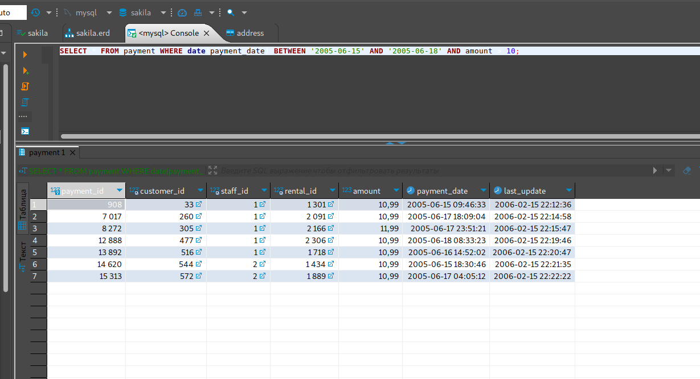
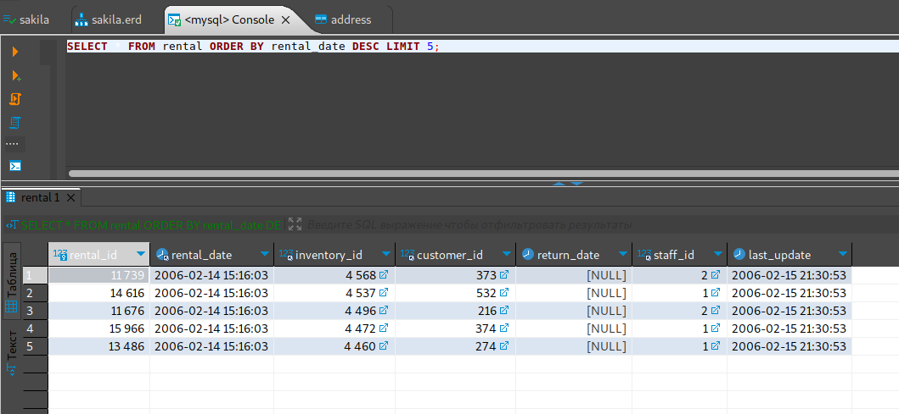
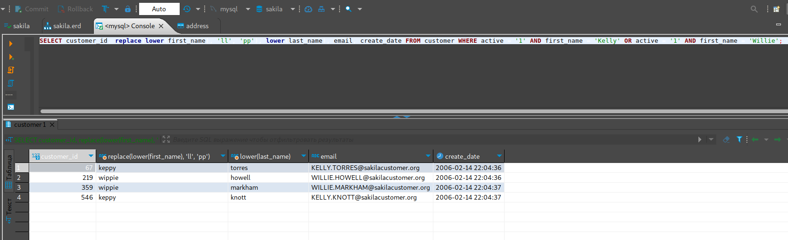

# Домашнее задание к занятию "`12.3. «SQL. Часть 1»`" - `Живарев Игорь`


### Задание 1

`Выводим названия районов из таблицы с адресами:`


```
SELECT DISTINCT district FROM address WHERE district LIKE 'K%a' AND locate(' ', district) = 0;

```





---

### Задание 2

`Получение из таблицы платежей за прокат фильмов информации по платежам:`
 

```
SELECT * FROM payment WHERE date(payment_date) BETWEEN '2005-06-15' AND '2005-06-18' AND amount > 10;

```





---

### Задание 3

`Последние пять аренд фильмов:`

```
SELECT * FROM rental ORDER BY rental_date DESC LIMIT 5;

```




### Задание 4

`Получение одним запросом активных покупателей:`

```
SELECT customer_id, replace(lower(first_name), 'll', 'pp'), lower(last_name), email, create_date FROM customer WHERE active = '1' AND first_name = 'Kelly' OR active = '1' AND first_name = 'Willie';

```


